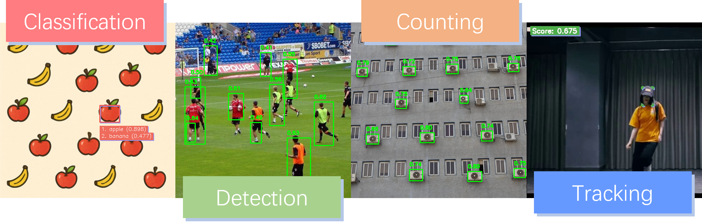
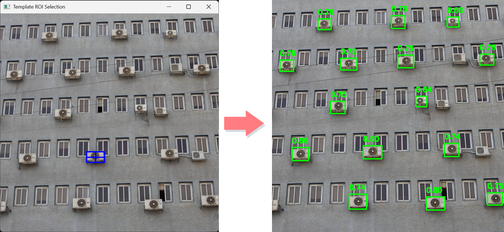
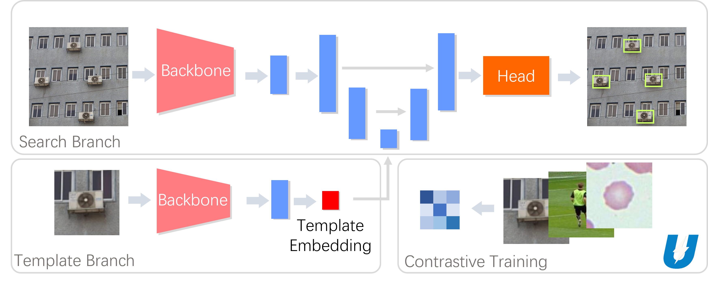

#  UMatcher: A modern template matching model



Template matching is a classic technique in computer vision, but in this project, we've given it a modern twist! Introducing UMatcher, a compact yet powerful model built on the UNet architecture. Unlike large-scale visual prompting models such as T-REX, UMatcher contains only 4M parameters, making it extremely lightweight and suitable for deployment on edge devices. (Check out our [NCNN demo](demo/umatcher_ncnn/)! 🚀)

UMatcher is versatile and can be easily adapted for a variety of tasks, including:

    🔍 Object Detection (one-shot/few-shot)

    🎯 Object Tracking

    🔢 Object Counting

    🧠 Classification

Hope this project help you, Enjoy and have fun! 😄

## Python Example
**install requirements**
```shell
conda env create -f umatcher_env.yml
```
```shell
conda activate umatcher 
```
**detection example**
```shell
python  scripts/detection_example.py
```
If you're using a desktop environment, try --live_mode to select a template and view detection results in real time.
```shell
python  scripts/detection_example.py --live_mode --template_img data/target_3.png --search_img data/target_3.png
```


**tracking example**
```shell
python  scripts/tracking_example.py
```


The command above will automatically load [data/girl_dance.mp4](data/girl_dance.mp4), track the target using the predefined initial bounding box, and save the results to data/tracking_result.mp4. If you're using a desktop environment, you can also manually select the bounding box instead.

```shell
python  scripts/tracking_example.py --live_mode
```

## Train

You can easily use **COCO(17)** or **SA1B(subset is ok)** to train the UMatcher

Modify **TRAIN_DATASETS** section in [configs/config.yaml](configs/config.yaml) and train by
```shell
python  scripts/train_matcher.py configs/config.yaml
```
Note: if you only have one gpu, set **GPU_IDS** to **[0]**

After training, you can export it into onnx model by
```shell
python  scripts/export_onnx.py
```

## C++ DEMO

### NCNN
You can use pnnx covert onnx model into ncnn model
```shell
pnnx template_branch.onnx inputshape=[1,3,128,128]f16
pnnx search_branch.onnx inputshape=[1,3,256,256]f16,[1,128,1,1]f16
```

To setup ncnn, fellow these steps:

<details>
<summary>INSTALL NCNN</summary>
Download ncnn [release code](https://github.com/Tencent/ncnn/archive/refs/tags/20250503.zip).

Install the requirements of ncnn

On Debian, Ubuntu, or Raspberry Pi OS, you can install all required dependencies using:
```shell
sudo apt install build-essential git cmake libprotobuf-dev protobuf-compiler libomp-dev libopencv-dev
```

On Redhat or Centos, you can install all required dependencies using:
```shell
sudo yum install build-essential git cmake libprotobuf-dev protobuf-compiler libopencv-dev
```

Unzip and build ncnn
```shell
cd ncnn
mkdir -p build
cd build
cmake -DCMAKE_BUILD_TYPE=Release -DNCNN_VULKAN=ON -DNCNN_BUILD_EXAMPLES=ON ..
make -j$(nproc)
```

</details>

After Setup

Build detector or tracker demo
```shell
cd demo/umatcher_ncnn
mkdir build
cd build
make detector_demo
make tracker_demo
```

Copy data folder into demo/umatcher_ncnn 
```shell
cp -r ../../../data ../
```

You can use **detector_demo** or **tracker_demo** like python example or get help by
```shell
./detector_demo --help
./tracker_demo --help
```


### RKNN

You can use rknn-toolkit convert onnx model to rknn model (ver2.3.2). a [script](scripts/rknn_convert.py) is provide to reference. Learn more how to use rknn please check [official repo](https://github.com/airockchip/rknn-toolkit2).

Build detector or tracker demo
```shell
cd demo/umatcher_rknn
mkdir build
cd build
make detector_demo
make tracker_demo
```

Copy data folder into demo/umatcher_ncnn 
```shell
cp -r ../../../data ../
```

You can use **detector_demo** or **tracker_demo** like python example or get help by
```shell
./detector_demo --help
./tracker_demo --help
```
### Note
If you find that the detector's performance is not ideal, the following points might help:  
- The detector uses a pyramid to handle different scales. If it's too slow, try reducing the number of pyramid layers.  

- In the demo, the scale_factor for calculating the pyramid scales is based on the template's dimensions. Therefore, when the scale is 1, targets of similar size to the template are easier to detect. Alternatively, you can modify this scale_factor yourself.  

- Extract multiple templates and take their average (don’t forget to normalize into unit vector).

## Model Design

UMatcher is a framework inspired by SiamFC-style object tracking models, featuring both a search branch and a template branch. 🔍🧩



Unlike traditional trackers that rely on dynamic convolutions or other specialized operators—which can pose challenges for deployment on specific hardware（Different SoCs offer varying levels of NPU support for specialized operators, with many having limited compatibility）—UMatcher leverages a UNet-based architecture for feature fusion. This design choice simplifies deployment and improves cross-platform compatibility. 🚀

Another key innovation in UMatcher is the use of contrastive learning for the template branch. Instead of maintaining raw template features, the template is compressed into a highly compact and expressive embedding. This not only streamlines representation but also opens up exciting new possibilities:

  You can perform classification tasks directly based on template embeddings. Check out our [classification example](scripts/classification_example.py) to see it in action!

